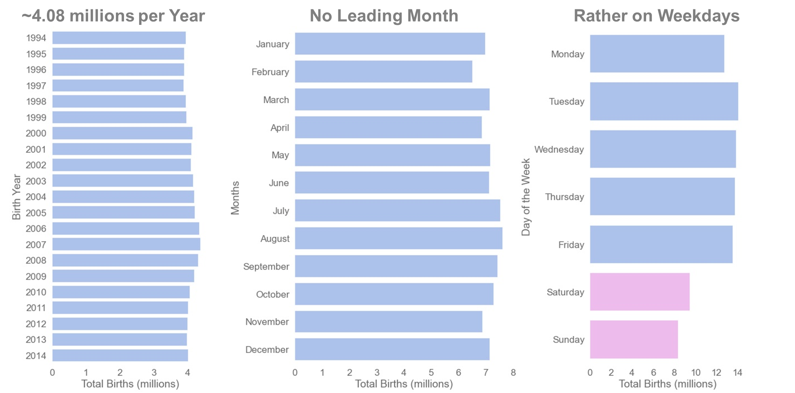
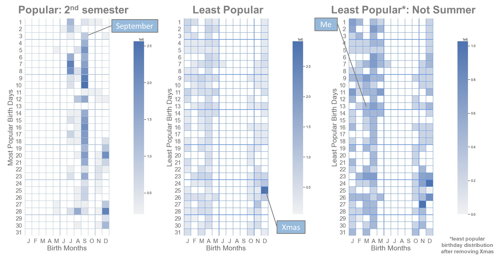
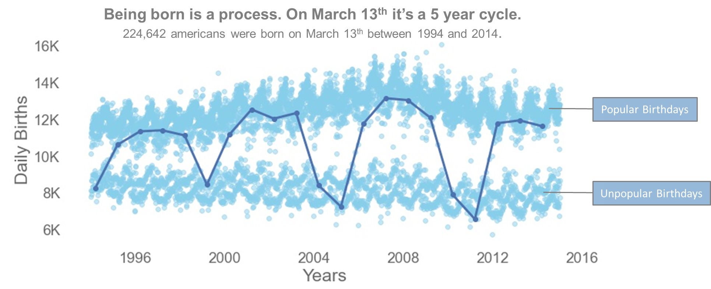
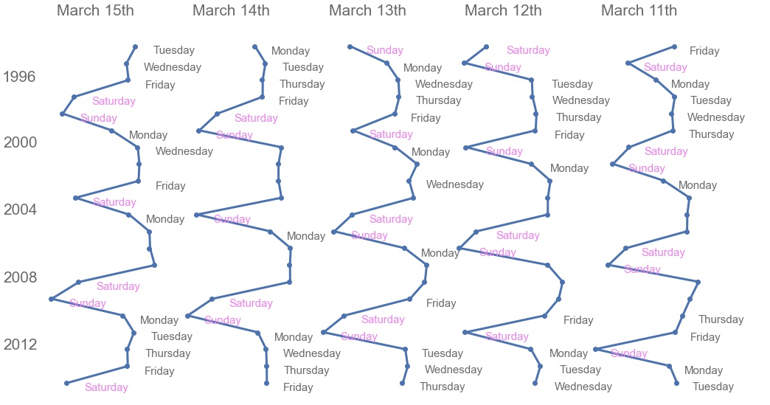
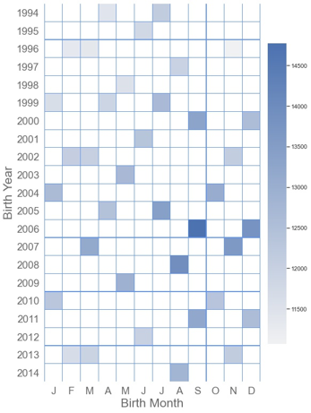

[BACK TO MAIN REPO PAGE](https://github.com/Aurenkeelin18/For_You_Thorough_Recruiter)

## THE DATA: U.S. BIRTHS (1994-2014)
I read an article written by **Ravi Charan** in **Towards Data Science** that discussed the uniform birthday problem and proposed a model to describe the variations in birth [read article](https://towardsdatascience.com/how-popular-is-your-birthday-91ab133f7fc4) .
Thought the article was interesting I did not think the content of the article was really answering the question raised in the title **"How Popular is your Birthday"**, as in "How Popular is **MY** Birthday" **:)** So I set out to get the [data](https://github.com/fivethirtyeight/data/tree/master/births) and selfishly look into it (the data is a combination of the National Center for Health Statistics (1994-2003) and the Social Security Administration (2000-2014)).

Another article written by **Carl Bialik** on a similar topic ["Some people are too superstitious to have a baby on Friday the 13th"](https://fivethirtyeight.com/features/some-people-are-too-superstitious-to-have-a-baby-on-friday-the-13th/)  amused me because my 13th birthday was a Friday and I was born at 1pm (assumed 13h00 in France, my birth country).

## THE QUESTIONS
Birth may happen naturally or can be induced for practical or medical reasons. 

According to the [CDC]([https://www.cdc.gov/nchs/products/databriefs/db155.htm) the current rate of induction is 23% and the trend has been decreasing.
In other words induction is not a discrete practice, probably happening all year long.

My questions are:
* Which birthdays have the most births? the least births? 
* Is it consistent throughout the years (1994-2014)?
* What about births on my birthday (March 13th)?
* How many kids are part of the "13th Birthday on Friday 13th" VIP13 club (like I do)?

## OVERVIEW OF U.S. BIRTHS (1994-2014)

There is an average of 4.1 million births in the U.S. each year from 1994 to 2014, ranging from 3.88 to 4.38 millions. This makes a total of 85.71 million babies born in the U.S. between 1994 and 2014. All in all there is not a huge variation of the total births throughout the years. 
The distribution of births within months does not show much variation. It tends to reflect the number of days that contains each months i.e. months with 31 days tends to dominate, except September which bears more births than October.
Births tends to happen rather during the week than during the weekend. There were 8 to 9 million births on Saturday and Sunday, while there is at least 13 million births each weekday.

## MOST POPULAR BIRTHDAYS

We will now be looking at birthdays. The way I handled it is very simple:
- first I collected the top 13 most (and least) popular birthday for each year between 1994 and 2014.
- then for each birthday I summed up the births that happened between 1994 and 2014.
- finally the resulting dataframe is plotted as a calendar heatmap.

(to the left) The heatcalendar of the most popular birthdays show the vast majority of popular birthday happens during the second half of the year. September seems to be the most popular birthday month.

(middle) The least popular birthdays can be summarized as "not happening in Summer'. Interestingly christmas (12/25) showed one of the lowest daily births for some years, but when cumulated over 21 years it turns out to be a popular birthday. 

(to the right) Once christmas is removed from the least popular birthdays, the picture is clearer. We can see that christmas eve (12/24) and the Thanksgiving period (the 4th Thursday of November) come second and third in the highest birth rates within the unpopular birthdays. The month with the less popular birthdays are found in January, February and March. Note that the popular birthdays bear 2.5 times more births than the unpopular birthdays.
My birthday, March 13th, turns out to be an unpopular birthday with an average birth count for its category.

## MARCH 13TH

The 'March 13th' time series plot shows an interesting cyclicity. The birth rate on March 13th tends to drop dramatically (-6,000) every five years. It has nothing to do with superstition (i.e. falling on a Friday) or leap years or anything obvious related to birth.
We can see also a cyclicity in the most popular birthdays (upper group from 11k to 16k births) and the least popular birthdays (lower group from 7k to 11k).
For the numbers: 224,642 babies were born on March 13th between 1994 and 2014.

## BIRTHDAY CYLCES: AMERICAN BABIES HATE WEEKENDS!
The cyclicity has nothing to do with superstition (i.e. falling on a Friday) but it tied to a fact we have seen earlier: birth happens more likely during the week (babies hate weekends). A given birthday record less births if it falls on a Saturday or Sunday.

## VIP13 CLUB
The VIP Club from 1994 to 2014:
- 460,584 americans have celebrated or will celebrate their 13th birthday on a Friday 13th. This represent 0.5% of the 85.7 millions babies born between 1994 and 2014.
- 48,453 americans were  born on March 13th. This represent 0.06% of the 85.7 millions babies born between 1994 and 2014.
- Note that March 13th 2013 fell on a Wednesday.

## SUMMARY AND CONCLUSIONS
U.S. Birth data from 1994 to 2014 showed:
* About 4 million births per year.
* Birth is more likely to happen on weekdays than weekends.
* Most births happen in Summer. The most popular birth month is September. 
* Xmas is a cumulative popular birthday, though it falls in the unpopular birthday when looking at individual years.

Regarding March 13th:
* March 13th births time series shows cyclicity. 
* Every 5 years births drop to unpopular rates.
* The drop in births happens on weekends.
* 224,642 americans were born on March 13th between 1994 and 2014.

The VIP13 Club: 
* Almost ½ a million americans were born on 13th between 1994 and 2014 and have celebrated or will celebrate their 13th birthday on a Friday.
* Among them 48,453 were born on March 13th. 

Going Further with the Data: The dataset has many more stories to tell!

The picture in the title banner is from https://www.paws2purrfection.com/customized-birthday-cakes-for-dogs-blue-skull-theme/

[BACK TO MAIN REPO PAGE](https://github.com/Aurenkeelin18/For_You_Thorough_Recruiter)
